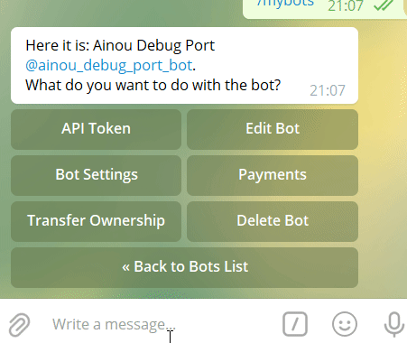

# Telegram Archive Server

[](https://github.com/oott123/telegram-archive-server/actions/workflows/ci.yaml) [](./README.md) [](https://github.com/oott123/telegram-archive-server/releases) [](https://quay.io/repository/oott123/telegram-archive-server?tab=tags) [](./LICENSE)

一个适合 CJK 环境的，Telegram 群聊搜索和归档机器人。

## 功能概览

- 支持群成员鉴权，仅群友可以搜索
- 支持导入历史聊天记录，自动去重
- 使用 MeiliSearch 对中文进行搜索，索引效果好
- 支持图片 OCR 纳入搜索结果（仅支持新增，尚未支持历史图片）
- 有简单的网页界面，可以显示头像
- 搜索结果可以跳转打开聊天界面

## 展示

### 聊天鉴权


点击【搜索】按钮即可自动鉴权打开搜索界面。

### 搜索界面


点击时间链接即可跳转聊天界面。


## 部署

### 准备

你需要：

- 一个 Bot 帐号，事先获取它的 token
- 一个公网可及的 https 服务器，如果不用 WebHook 的话 http 也行
- 一个**超级群**，目前只支持超级群
- 一个 MeiliSearch 实例，配不配置 key 都行
- 一个 Redis 实例，没有也行，就是可能异常重启会丢消息

### 配置

下载 [`.env.example`](./.env.example) 文件，参考内部注释，进行相应配置。

你可以将它保存为 `.env` ，或是作为环境变量配置。

### 运行

#### With Docker

```bash
docker run -d --restart=always --env-file=.env quay.io/oott123/telegram-archive-server
```

当然，也可以使用 Kubernetes 或者 docker-compose 运行。

#### Using Source Code

如果没有 Docker 或者不想用 Docker，也可以从源码编译部署。此时你还需要：

- git
- node 14

```bash
git clone https://github.com/oott123/telegram-archive-server.git
cd telegram-archive-server
# git checkout vX.X.X
cp .env.example .env
vim .env
yarn
yarn build
yarn start
```

### 使用

在群里发送 `/search`。Bot 可能会提示你设置 Domain，按提示设置即可。



#### 获取用户头像

用户必须满足以下条件，才能在搜索结果中展示头像：

- 曾与 Bot 交互过（发送过消息，或是授权登录过）
- 用户设置头像公开可见

#### 新记录的索引规则

由于 MeiliSearch 对新消息的索引效率较差，只有在满足如下任意条件时，消息才会进入索引：

- 60 秒内没有收到新消息
- 累计收到了 100 条没有进入索引的消息
- 主进程接收到 SIGINT 信号

如果没有使用 redis 以持久化消息队列，在程序异常、服务器重启时可能会丢失未进入队列的消息。

### 导入老的聊天记录

**当前仅支持超级群导入。**

在桌面客户端点击三点按钮 - Export chat history，等待导出完成，得到 `result.json`。

执行：

```bash
curl \
  -H "Content-Type: application/json" \
  -H "Authorization: Bearer $AUTH_IMPORT_TOKEN" \
  --data @result.json \
  http://localhost:3100/api/v1/import/fromTelegramGroupExport
```

即可导入记录。注意只能导入单个群的记录。

### OCR 识别文字(TBD)

如果启用 OCR 队列，那么 Redis 是必须的（可以和缓存共用一个实例），并配置第三方识别服务。识别流程如下：

[](https://mermaid.live/edit/#eyJjb2RlIjoic2VxdWVuY2VEaWFncmFtXG4gIGF1dG9udW1iZXJcbiAgQm905a6e5L6LLT4-K09DUuWunuS-izog6YCa6L-HIE9DUiDpmJ_liJflj5HpgIHlm77niYdcbiAgT0NS5a6e5L6LLT4-K09DUuacjeWKoTog6K-G5Yir5Zu-54mHXG4gIE9DUuacjeWKoS0-Pi1PQ1Llrp7kvos6IOi_lOWbnue7k-aenFxuICBPQ1Llrp7kvostPj4tQm905a6e5L6LOiDpgJrov4flhaXlupPpmJ_liJflj5HpgIHor4bliKvnu5PmnpxcbiAgYWN0aXZhdGUgQm905a6e5L6LXG4gIEJvdOWunuS-iy0-Pi1NZWlsaVNlYXJjaDog5YWl5bqTIiwibWVybWFpZCI6IntcbiAgXCJ0aGVtZVwiOiBcImRlZmF1bHRcIlxufSIsInVwZGF0ZUVkaXRvciI6dHJ1ZSwiYXV0b1N5bmMiOnRydWUsInVwZGF0ZURpYWdyYW0iOnRydWV9)

识别和入库可以在不同的角色实例上完成：图片下载和文本入库将在 Bot 实例上完成，OCR 实例仅需访问 OCR 服务即可。

这样的设计使得维护者可以设计离线式的集中识别（例如使用抢占式实例运行识别服务，队列清空后关机），降低识别成本。

如果你使用的是第三方云服务，可以直接关闭 OCR 队列，或是在同一个实例中开启 Bot 和 OCR 角色。

#### 识别服务

##### Google Cloud Vision

参考 [Google Cloud Vision 文本识别文档](https://cloud.google.com/vision/docs/ocr) 和 [Google Cloud Vision 计费规则](https://cloud.google.com/vision/pricing)。配置如下：

```bash
OCR_DRIVER=google
OCR_ENDPOINT=eu-vision.googleapis.com # 或者 us-vision.googleapis.com ，决定 Google 在何处存储处理数据
GOOGLE_APPLICATION_CREDENTIALS=/path/to/google/credentials.json # 从 GCP 后台下载的 json 鉴权文件
```

#### 启动不同角色

```bash
docker run [...] dist/main ocr,bot
# or
node dist/main ocr,bot
```

## 开发

```bash
DEBUG=app:*,grammy* yarn start:debug
```

### 前端开发

搜索服务鉴权后，服务端会跳转到：`$HTTP_UI_URL/index.html` 并带上以下 URL 参数：

- `tas_server` - 服务器基础 URL，形如 `http://localhost:3100/api/v1`
- `tas_indexName` - 群号，形如 `supergroup1234567890`
- `tas_authKey` - 服务器签发的 JWT，可以用来作为 MeiliSearch 的 api key 使用。

### MeiliSearch 兼容

在 `/api/v1/search/compilable/meili` 处可以当作普通的 MeiliSearch 实例进行搜索。

索引名应该使用形如 `supergroup1234567890` 的群号； API Key 则是服务端签发的 JWT。

请注意 filter 由于安全原因暂时不可使用。
